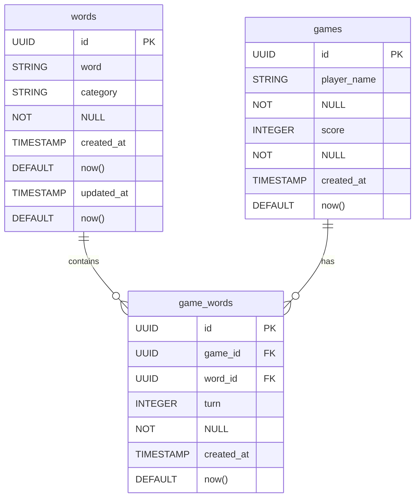
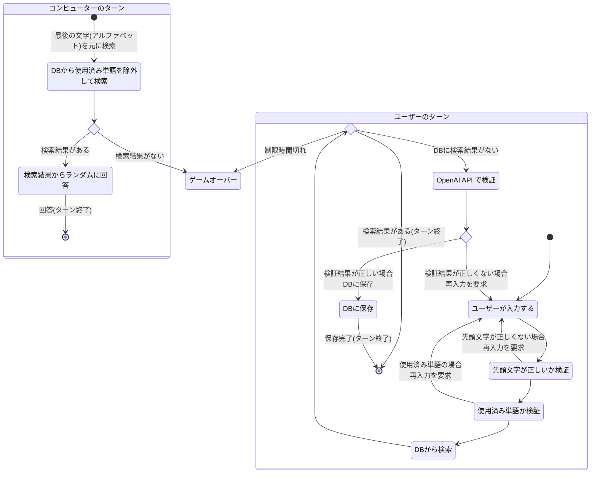

# 技術的設計 

## データベース設計

### **テーブル一覧**

#### **words (単語リスト)**
| カラム名     | 型          | 制約                  | 説明                       |
|-------------|------------|----------------------|--------------------------|
| id          | UUID       | PRIMARY KEY         | 一意の識別子              |
| word        | STRING     | UNIQUE, NOT NULL   | 単語（小文字で統一）      |
| category    | STRING     | NOT NULL           | 単語の種類（メソッド, クラス, etc.）|
| created_at  | TIMESTAMP  | DEFAULT now()      | 作成日時                  |
| updated_at  | TIMESTAMP  | DEFAULT now()      | 更新日時                  |

#### **games (ゲーム履歴)**
| カラム名     | 型          | 制約                  | 説明                       |
|-------------|------------|----------------------|--------------------------|
| id          | UUID       | PRIMARY KEY         | 一意の識別子              |
| player_name | STRING     | NOT NULL           | プレイヤー名               |
| score       | INTEGER    | NOT NULL           | 繋げた単語の数            |
| created_at  | TIMESTAMP  | DEFAULT now()      | 作成日時                  |

#### **game_words (ゲーム内単語使用履歴)**
| カラム名     | 型          | 制約                  | 説明                       |
|-------------|------------|----------------------|--------------------------|
| id          | UUID       | PRIMARY KEY         | 一意の識別子              |
| game_id     | UUID       | FOREIGN KEY         | 関連するゲーム ID         |
| word_id     | UUID       | FOREIGN KEY         | 使用された単語 ID         |
| turn        | INTEGER    | NOT NULL           | 何ターン目の単語か        |
| created_at  | TIMESTAMP  | DEFAULT now()      | 作成日時                  |

### ER図

## ゲームロジック

### ゲームの流れ

- ユーザーが先攻
- 交互に入力する

